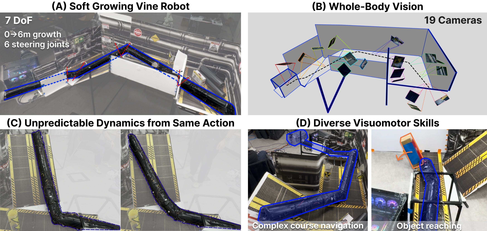

# PanoVine: Whole-Body Visuomotor Control for Soft Growing Vine Robot

[[Project page]](https://panovine-bot.github.io)
[[Paper]](https://arxiv.org/abs/2606.22923)
[[Video]](#)

[Yimeng Qin*](https://scholar.google.com/citations?user=KCkNCOYAAAAJ&hl=en),
[Xiaomeng Xu*](https://xxm19.github.io/),
[William Heap](#),
[Aditi Oak](#),
[Shuran Song†](https://shurans.github.io/),
[Allison Okamura†](http://charm.stanford.edu/Main/AllisonOkamura)

*Equal Contribution, †Equal Advising

Stanford University



## 🛠️ Installation

Clone this repo:
```bash
git clone https://github.com/xxm19/panovine.git
cd panovine
```

Create the mamba environment (We recommend [Mambaforge](https://github.com/conda-forge/miniforge#mambaforge) over the standard Anaconda distribution for a faster environment solve):
```bash
mamba env create -f conda_environment.yaml
conda activate panovine
```

> **On-robot data collection and inference** (`unified_data_logger.py`, `policy_inference.py`) additionally require a [ROS Noetic](http://wiki.ros.org/noetic) installation providing `rospy`/`std_msgs`, plus the vine robot motor and sensor drivers. These are **not** needed for offline data processing or policy training, which run from the conda environment alone.

## Demonstration Collection and Processing

### Data recording
```bash
python unified_data_logger.py
```

saved file structure:
- `robot_logs/baseStation/<id>/*_sensors.npz`  (base encoder, pressure, torque)
- `robot_logs/controller2/<id>/*_sensors.npz`  (imu_id, encoder1/2, roll/pitch/yaw)
- `robot_logs/camera/<id>/cam_*.{mp4,avi}` + timestamp csv/json

### Data post-processing

```bash
python process_data_parallel.py \
  --log-root robot_logs \
  --output-path dataset.zarr.zip \
  --num-workers 16 \
  --action-repr angle
```

## Policy Training

The training config is:

`diffusion_policy/config/train_diffusion_transformer_free_space_vine_workspace.yaml`

Run training:

```bash
python train.py \
  --config-name train_diffusion_transformer_free_space_vine_workspace \
  task.dataset_path=dataset.zarr.zip
```

multi-gpu
```bash
accelerate launch --num_processes 4 \
  train.py --config-name train_diffusion_transformer_free_space_vine_workspace \
  task.dataset_path=dataset.zarr.zip
```

## Inference on Robot

```bash
python policy_inference.py \
  --config-name train_diffusion_transformer_free_space_vine_workspace \
  input=/path/to/ckpt.ckpt
```

## 📜 Citation
```console
@misc{qin2026panovinewholebodyvisuomotorcontrol,
      title={PanoVine: Whole-Body Visuomotor Control for Soft Growing Vine Robot}, 
      author={Yimeng Qin and Xiaomeng Xu and William Heap and Aditi Oak and Shuran Song and Allison Okamura},
      year={2026},
      eprint={2606.22923},
      archivePrefix={arXiv},
      primaryClass={cs.RO},
      url={https://arxiv.org/abs/2606.22923}, 
}
```

## 🏷️ License
This repository is released under the MIT license. See [LICENSE](https://github.com/xxm19/panovine/blob/main/LICENSE) for more details.

## 🙏 Acknowledgement
- Our policy implementation is adapted from [RoboPanoptes](https://github.com/real-stanford/RoboPanoptes) and [UMI](https://github.com/real-stanford/universal_manipulation_interface).
